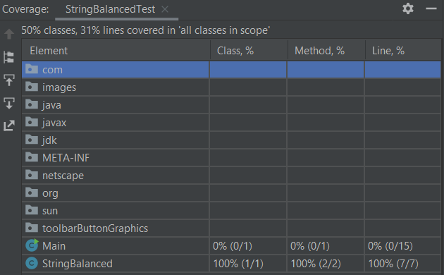
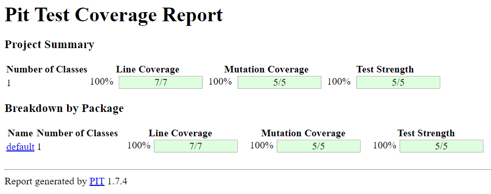

### Question 1

L'établissement des valeurs pouvant être prises par les strings étant plus compliquée que par l'utilisation de strings,
nous avons tenté de couvrir la majorité des cas possibles pour les string balancées pour l'input space partitionning.

| Characteristics | Blocks |      |
| --- | --- | --- |
| str is null     | false  |      |
| str is empty    | true   |      |
| str is balanced | false  | true |

| Characteristics | Valeur |
| --- | --- |
| String sans symboles ex:"kuehvo*\" | true |
| Symboles balancés ex:"{}\" | true |
| Symboles balancés avec des caractères supplémentaires ex:"{\t(e)s(t)*[{abc}]}"| true |
| Symboles balancés passant 2 fois dans la boucle while ex:"([{}])" | true |
| Symboles balancés passant 2 fois dans la boucle while, avec des caractères supplémentaires ex:"(as[ae{bvf}*]o()\f)" | true |
| String vide | true |
| Symboles correspondants croisés ex:"([)]" | false |
| Symboles correspondants croisés, avec des caractères supplémentaires ex:"m(o[ashgr)ki]" | false |
| Symboles correspondants inversés ex:"][" | false |
| Symboles correspondants inversés, avec des caractères supplémentaires ex:"aa]ef[bfe" | false |
| Symboles non balancés ex:"()]" | false |
| Symboles non balancés, avec des caractères supplémentaires ex:"(test)**]" | false |
| String null | NullPointerException |

### Question 2

Notre coverage étant déjà à 100 % sur les classes, nous n'avons pas établis de tests supplémentaires.

### Question 3 

Dans notre code nous possédons effectivement un prédicat qui utilise plus de deux opérateurs booléens, le voici :

str.contains("()") || str.contains("[]") || str.contains("{}")
pour la suite on utilisera 
- A pour str.contains("()")
- B pour str.contains("[]")
- C pour str.contains("{}")

On bloque B et C :

| A | B | C | Result |
|---|---|---|---|
| 0 | 0 | 0 | 0 |
| 1 | 0 | 0 | 1 |

On bloque A et C :

| A | B | C | Result |
|---|---|---|---|
| 0 | 0 | 0 | 0 |
| 0 | 1 | 0 | 1 |

On bloque A et B :

| A | B | C | Result |
|---|---|---|---|
| 0 | 0 | 0 | 0 |
| 0 | 0 | 1 | 1 |

On a donc 4 valeurs différentes pour le prédicat :

| A | B | C |
|---|---|---|
| 0 | 0 | 0 |
| 1 | 0 | 0 |
| 0 | 1 | 0 |
| 0 | 0 | 1 |

Parmis nos tests, seule la première ligne est couverte (avec la string vide).
Nous ajouterons donc 3 tests qui couvreront les 3 dernières lignes du tableau précédent, en utilisant les strings les plus simples : "()", "[]" et "{}".

### Question 4

Utilisation de PIT :

