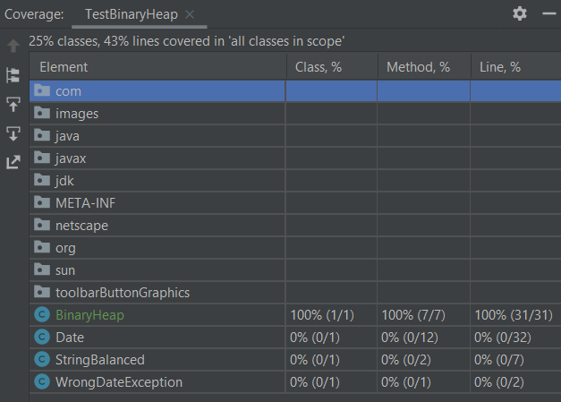
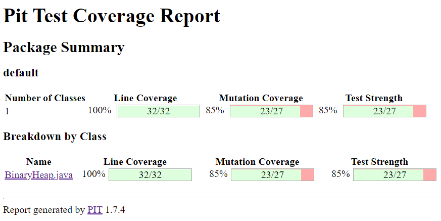

# Implementing and testing a binary heap

A [*binary heap*](https://en.wikipedia.org/wiki/Binary_heap) is a data structure that contains comparable objects and it is able to efficiently return the lowest element.
This data structure relies on a binary tree to keep the insertion and deletion operations efficient. It is the base of the [*Heapsort* algorithm](https://en.wikipedia.org/wiki/Heapsort).

Implement a `BinaryHeap` class with the following interface:

```java
public class BinaryHeap<T> {

    private Comparator<T> comparator;

    public BinaryHeap(Comparator<T> comparator) { ...}

    public T pop() throws NoSuchElementException { ...}

    public T peek() throws NoSuchElementException { ...}

    public void push(T nouveau) { ...}
}
```

A `BinaryHeap` instance is created using a `Comparator` object that represents the ordering criterion between the objects in the heap.
`pop` returns and removes the minimum object in the heap. If the heap is empty it throws a `NotSuchElementException`.
`peek` similar to `pop`, returns the minimum object but it does not remove it from the `BinaryHeap`.
`push` adds an element to the `BinaryHeap`.
`count` returns the number of elements in the `BinaryHeap`.

Design and implement a test suite for this `BinaryHeap` class.
Feel free to add any extra method you may need.

Use the following steps to design the test suite:

1. With the help of *Input Space Partitioning* design a set of initial test inputs for each method. Write below the characteristics and blocks you identified for each method. Specify which characteristics are common to more than one method.
2. Evaluate the statement coverage of the test cases designed in the previous step. If needed, add new test cases to increase the coverage. Describe below what you did in this step.
3. If you have in your code any predicate that uses more than two boolean operators check if the test cases written to far satisfy *Base Choice Coverage*. If needed add new test cases. Describe below how you evaluated the logic coverage and the new test cases you added.
4. Use PIT to evaluate the test suite you have so far. Describe below the mutation score and the live mutants. Add new test cases or refactor the existing ones to achieve a high mutation score.

Use the project in [tp3-heap](../code/tp3-heap) to complete this exercise.

## Answer

## Question 1

### Méthode push() :

C'est ici que la création d'un jeu de données établi à partir de l'input space partionning a du sens.
En entrée nous avons un objet de type T.
Nous avons décidé, pour les cas de tests, de nous baser sur le type Integer qui s'étend de -2147483648 à 2147483647.
Ainsi nous pouvons établir 3 blocks différents

#### Séléction d'un nombre fini de paramètres :

Dans notre classe de test [ici](../code/tp3-heap/src/test/java/fr/istic/vv/BinaryHeapTest.java), nous avons défini 
1 jeu de données d'entrée afin de parcourir l'entièreté du graphe d'exécution de la méthode push() :

| Characteristics | Blocks | | |
| --- | --- | --- | --- |
| Value of nouveau | < 0 | 0 | \> 0 |

Les entrées étant liées aux entrées globales (précédentes, déjà présentes dans le tableau), 
il est préférable de passer également par une couverture de chemins :

#### Prédicats et bocks de code :

- P1 : if(heap.contains(nouveau)){
- B1 : return;
- P2 : if(heap.size()>1){
- P3 : while(this.comparator.compare(nouveau, parent) > 0){
- P4 : if(parentIndex.equals(0))
- B2 : break;

Parent étant l'élément juste au dessus de nouveau dans l'arbre binaire.

#### Couverture des chemins :

- P1 : if(heap.contains(nouveau)){
- B1 : return;
- P2 : if(heap.size()>1){
- P3 : while(this.comparator.compare(nouveau, parent) > 0){
- P4 : if(parentIndex.equals(0))
- B2 : break;
- B3 : end

Nous pouvons donc établir ce jeu de données ci-dessous :

| Tableau d'entrée | chemin couvert |
| --- | --- |
| [1,1] | P1 -> B1 |
| [1] | P1 -> P2 -> B3|
| [5, 1] | P1 -> P2 -> P3 -> B3 |
| [10, 3, 11] | P1 -> P2 -> P3 -> P4 -> B2 |
| [10, 3, 11, 25] | P1 -> P2 -> P3 -> P4 -> P3 -> P4 -> B2 |
| [10, 3, 11, 25, 12, 9, -5, 14] | P1 -> P2 -> P3 -> P4 -> P3 -> P4 -> B3 |

Vous trouverez ce jeu d'entrée dans notre classe de test dans la fonction provideHeapVerifications qui servira de base
pour le test testPush()

## Question 2

Couverture de Test : 

Il nous manque une partie de la fonction findMinHeapIndex(), comme précisé si dessous :

Nous avons donc ajouté un cas de tests à la fin de BinaryHeapTest tel que :
```java
@Test
public void testFindMinHeapIndex(){
    new ArrayList<>(Arrays.asList(25, 10, 7, 5 , 6, 2, 1, 4, 3)).forEach((n) -> bibi.push(n));
    assertEquals(6, bibi.findMinHeapIndex());
    assertEquals(1, bibi.getHeap().get(bibi.findMinHeapIndex()));
}
```

Nouvelle couverture de test :


## Question 3 

Nous ne possédons pas de conditions ayant plus d'un opérateur booléen.

## Question 4

PIT Report :


Nous considérons les mutants comme "changed conditional boundary → SURVIVED" non tués comme étant des mutant équivalents.
En revanche il reste un mutant provenant d'un changement d'addition en soustraction dans la méthode findMinHeapIndex
que nous n'avons pas réussi à éliminer que voici :

Replaced integer addition with subtraction → SURVIVED

La seule addition se trouvant dans la fonction findMinHeapIndex() se trouve au calcul du voisin du parent du dernier ajouté.
Nous avons donc ajouté un cas de test permettant de le couvrir (testFindMinHeapIndex2()). Nous atteignons ainsi une
couverture de 85%, avec uniquement des mutants considérés comme équivalents.

PIT Report 2 :
