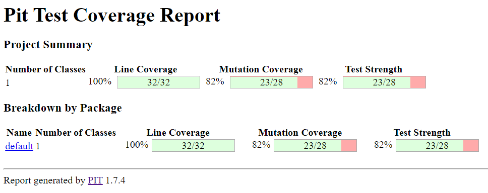

# Implementing and testing a binary heap

A [*binary heap*](https://en.wikipedia.org/wiki/Binary_heap) is a data structure that contains comparable objects and it is able to efficiently return the lowest element.
This data structure relies on a binary tree to keep the insertion and deletion operations efficient. It is the base of the [*Heapsort* algorithm](https://en.wikipedia.org/wiki/Heapsort).

Implement a `BinaryHeap` class with the following interface:

```java
import java.util.ArrayList;
import java.util.Comparator;
import java.util.NoSuchElementException;

public class BinaryHeap<T> {

    private ArrayList<T> heap;
    private Comparator<T> comparator;

    /**
     * Constructeur permettant d'initialiser notre arbre binaire à partir d'une ArrayList
     * Cet arbre binaire est rangé du haut vers le bas dans l'ordre croissant (minimum tout en haut)
     */
    public BinaryHeap(Comparator<T> comparator, ArrayList<T> initiatedHeap) {
        this.comparator = comparator;
        this.heap = initiatedHeap;
        this.heap.sort(this.comparator);
    }

    public ArrayList<T> getHeap() {
        return heap;
    }

    /**
     * Fonction permettant de trouver et de retirer l'objet minimal de l'arbre binaire
     * @return T objet minimal de l'arbre binaire
     * @throws NoSuchElementException si l'arbre binaire est vide
     */
    public T pop() throws NoSuchElementException {
        T minHeap = heap.get(findMinHeapIndex());
        heap.remove(minHeap);
        return minHeap;
    }

    /**
     * Fonction permettant de trouver l'objet minimal de l'arbre binaire
     * @return T objet minimal de l'arbre binaire
     * @throws NoSuchElementException si l'arbre binaire est vide
     */
    public T peek() {
        return heap.get(findMinHeapIndex());
    }

    /**
     * Fonction permettant d'ajouter un élément à l'arbre binaire, l'ajout d'un élément existant déjà dans le tableau
     * n'aura aucun effet
     * On l'ajout à la fin de l'arbre. Ensuite, tant qu'il est plus petit que son parent, on l'échange avec son parent.
     * @param nouveau à ajouter dans l'arbre binaire
     */
    public void push(T nouveau) {
        if(heap.contains(nouveau)) return;
        heap.add(nouveau);
        if(heap.size()>1){
            int actualIndex = heap.size()-1;
            Integer parentIndex = (actualIndex-1)/2;
            T parent = this.heap.get(parentIndex);
            // Tant que le nouveau est plus grand, j'échange le parent et le nouveau
            while(this.comparator.compare(nouveau, parent) > 0){
                this.heap.set(actualIndex, parent);
                this.heap.set(parentIndex, nouveau);
                if(parentIndex.equals(0)) break;
                actualIndex = parentIndex;
                parentIndex = (actualIndex-1)/2;
                parent = this.heap.get(parentIndex);
            }
        }
    }

    /**
     * Fonction permettant d'obtenir le nombre d'éléments contenus dans l'arbre binaire
     * @return int le nombre d'éléments contenus dans l'arbre binaire
     */
    public int count() {
        return heap.size();
    }

    public int findMinHeapIndex(){
        if (heap.isEmpty()) throw new NoSuchElementException("You can't have minHeap in empty Heap");
        T minHeap = heap.get(heap.size()-1);
        int minHeapIndex = heap.size()-1;
        for (int actualElementIndex = heap.size()-2; actualElementIndex < (((heap.size()-1)-1)/2)+1; actualElementIndex++) {
            System.out.println("minHeap= "+minHeap);
            System.out.println("minHeapIndex= "+minHeapIndex);
            System.out.println("actualElement= "+heap.get(actualElementIndex));
            System.out.println("actualElementIndex= "+actualElementIndex);
            if(this.comparator.compare(minHeap, heap.get(actualElementIndex)) > 0){
                minHeap = heap.get(actualElementIndex);
                System.out.println("minHeap= "+minHeap);
                minHeapIndex = actualElementIndex;
                System.out.println("minHeapIndex= "+minHeapIndex);
            }
        }
        return minHeapIndex;
    }
}
```

A `BinaryHeap` instance is created using a `Comparator` object that represents the ordering criterion between the objects in the heap.
`pop` returns and removes the minimum object in the heap. If the heap is empty it throws a `NotSuchElementException`.
`peek` similar to `pop`, returns the minimum object but it does not remove it from the `BinaryHeap`.
`push` adds an element to the `BinaryHeap`.
`count` returns the number of elements in the `BinaryHeap`.

Design and implement a test suite for this `BinaryHeap` class.
Feel free to add any extra method you may need.

Use the following steps to design the test suite:

1. With the help of *Input Space Partitioning* design a set of initial test inputs for each method. Write below the characteristics and blocks you identified for each method. Specify which characteristics are common to more than one method.
2. Evaluate the statement coverage of the test cases designed in the previous step. If needed, add new test cases to increase the coverage. Describe below what you did in this step.
3. If you have in your code any predicate that uses more than two boolean operators check if the test cases written to far satisfy *Base Choice Coverage*. If needed add new test cases. Describe below how you evaluated the logic coverage and the new test cases you added.
4. Use PIT to evaluate the test suite you have so far. Describe below the mutation score and the live mutants. Add new test cases or refactor the existing ones to achieve a high mutation score.

Use the project in [tp3-heap](../code/tp3-heap) to complete this exercise.

## Answer

Classe de Test associée :
```java
import org.junit.jupiter.api.BeforeEach;
import org.junit.jupiter.api.DisplayName;
import org.junit.jupiter.api.Test;
import org.junit.jupiter.params.ParameterizedTest;
import org.junit.jupiter.params.provider.Arguments;
import org.junit.jupiter.params.provider.MethodSource;

import static org.junit.jupiter.api.Assertions.*;

import java.util.ArrayList;
import java.util.Arrays;
import java.util.NoSuchElementException;
import java.util.stream.Stream;

public class TestBinaryHeap {

    private BinaryHeap<Integer> bibi;
    private ArrayList<Integer> initiatedBibi;

    /**
     * Creates new empty heap called bibi for each test
     */
    @BeforeEach
    public void setUp() {
        bibi = new BinaryHeap<>(Integer::compareTo, new ArrayList<>());
    }

    /**
     * Provides a data set for the test of the method push
     * @return Stream of {entry datas, checking datas}
     */
    public static Stream<Arguments> provideHeapVerifications() {
        return Stream.of(
                Arguments.of(new ArrayList<>(Arrays.asList(1)), new ArrayList<>(Arrays.asList(1))),
                Arguments.of(new ArrayList<>(Arrays.asList(1,1)), new ArrayList<>(Arrays.asList(1))),
                Arguments.of(new ArrayList<>(Arrays.asList(5, 1)), new ArrayList<>(Arrays.asList(5, 1))),
                Arguments.of(new ArrayList<>(Arrays.asList(10, 3, 11)), new ArrayList<>(Arrays.asList(11, 3, 10))),
                Arguments.of(new ArrayList<>(Arrays.asList(10, 3, 11, 25)), new ArrayList<>(Arrays.asList(25, 11, 10, 3))),
                Arguments.of(new ArrayList<>(Arrays.asList(10, 3, 11, 25, 12, 9, -45, 14)), new ArrayList<>(Arrays.asList(25,14,10,12,11,9,-45,3)))
        );
    }

    /**
     * Test the push method
     * Excpected : each pushed ints must be well arranged
     * @param intsToAdd set of values to add to the heap
     * @param verificationHeap verification ArrayList to compare with the heap created
     */
    @ParameterizedTest
    @MethodSource("provideHeapVerifications")
    @DisplayName("Test method push")
    public void testPush(ArrayList<Integer> intsToAdd, ArrayList<Integer> verificationHeap) {
        intsToAdd.forEach((n) -> bibi.push(n));
        assertEquals(bibi.getHeap(), verificationHeap);
    }

    /**
     * Test the pop method
     * Expected : Pop method returns the minimal
     */
    @Test
    public void testPopNormal() {
        new ArrayList<>(Arrays.asList(10, 3, 11, 25)).forEach((n) -> bibi.push(n));
        Integer popedInteger = bibi.pop();
        assertEquals(3,popedInteger);
        assertEquals(new ArrayList<>(Arrays.asList(25, 11, 10)), bibi.getHeap());
    }

    @Test
    public void testPopThrowException() {
        assertThrows(NoSuchElementException.class, () -> bibi.pop());
    }

    @Test
    public void testPeekNormal() {
        new ArrayList<>(Arrays.asList(10, 3, 11, 25)).forEach((n) -> bibi.push(n));
        Integer popedInteger = bibi.peek();
        assertEquals(3,popedInteger);
        assertEquals(new ArrayList<>(Arrays.asList(25, 11, 10, 3)), bibi.getHeap());
    }

    @Test
    public void testPeekThrowException() {
        assertThrows(NoSuchElementException.class, () -> bibi.peek());
    }

    @Test
    public void testCount(){
        new ArrayList<>(Arrays.asList(10, 3, 11, 25)).forEach((n) -> bibi.push(n));
        bibi.pop();
        assertEquals(3,bibi.count());
    }

    @Test
    public void testCountEmptyHeap(){
        assertEquals(0,bibi.count());
    }

    @Test
    public void testFindMinHeapIndex(){
        new ArrayList<>(Arrays.asList(25, 10, 7, 5 , 6, 2, 1, 4, 3)).forEach((n) -> bibi.push(n));
        assertEquals(1, bibi.findMinHeapIndex());
    }
}
```

# Réponses BinaryHeap

## Question 1

### Méthode push() :

C'est ici que la création d'un jeu de données établi à partir de l'input space partionning a du sens.
En entrée nous avons un objet de type T.
Nous avons décidé, pour les cas de tests, de nous baser sur le type Integer qui s'étend de -2147483648 à 2147483647.
Ainsi nous pouvons établir 3 blocks différents

#### Séléction d'un nombre fini de paramètres :

Dans notre classe de test [ici](test/java/TestDate.java)
Nous avons défini 2 jeux de données d'entrée finis afin de parcourir l'entièreté du graphe d'exécution de la méthode isValidDate :

Un premier jeu de données pour les dates correctes :

| Characteristics | Blocks | | |
| --- | --- | --- | --- |
| Value of nouveau | < 0 | 0 | \> 0 |

Les entrées étant liées aux précédentes, il est préférable de passer par une couverture de chemins :

#### Prédicats et bocks de code :

- P1 : if(heap.contains(nouveau)){
- B1 : return;
- P2 : if(heap.size()>1){
- P3 : while(this.comparator.compare(nouveau, parent) > 0){
- P4 : if(parentIndex.equals(0))
- B2 : break;

Parent étant l'élément juste au dessus de nouveau dans l'arbre binaire.

#### Couverture des chemins :

- P1 : if(heap.contains(nouveau)){
- B1 : return;
- P2 : if(heap.size()>1){
- P3 : while(this.comparator.compare(nouveau, parent) > 0){
- P4 : if(parentIndex.equals(0))
- B2 : break;
- B3 : end

Nous pouvons donc établir ce jeu de données ci-dessous :

| Tableau d'entrée | chemin couvert |
| --- | --- |
| [1,1] | P1 -> B1 |
| [1] | P1 -> P2 -> B3|
| [5, 1] | P1 -> P2 -> P3 -> B3 |
| [10, 3, 11] | P1 -> P2 -> P3 -> P4 -> B2 |
| [10, 3, 11, 25] | P1 -> P2 -> P3 -> P4 -> P3 -> P4 -> B2 |
| [10, 3, 11, 25, 12, 9, -5, 14] | P1 -> P2 -> P3 -> P4 -> P3 -> P4 -> B3 |

Vous trouverez ce jeu d'entrée dans notre classe de test dans la fonction provideHeapVerifications qui servira de base
pour le test testPush()

## Question 2

Couverture de Test : 

Il nous manque une partie de la fonction findMinHeapIndex(), comme précisé si dessous :

Nous avons donc ajouté des cas de tests à la fin de BinaryHeapTest

## Question 4

PIT Report :

(en cours)