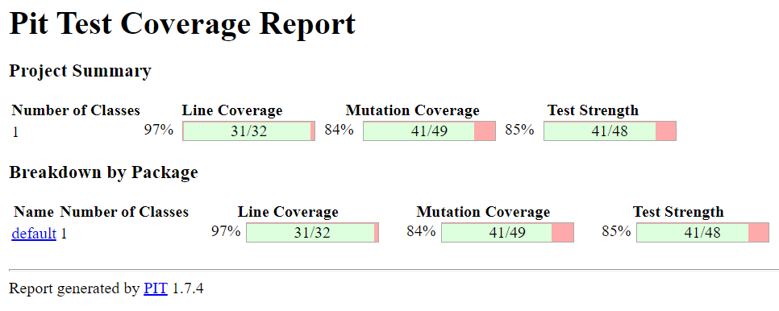
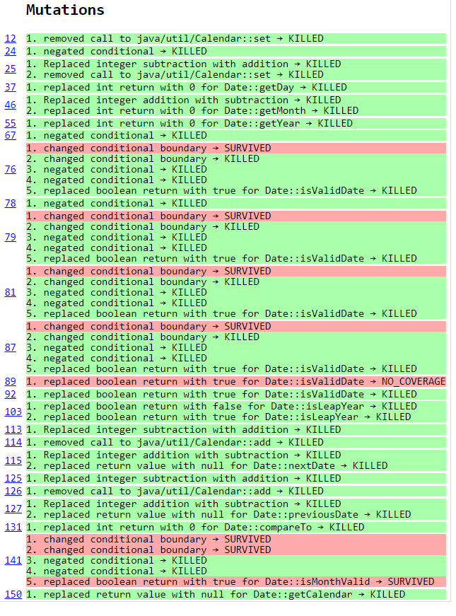

# Test the Date class

Implement a class `Date` with the interface shown below:

```java
class Date implements Comparable<Date> {

    public Date(int day, int month, int year) { ... }

    public static boolean isValidDate(int day, int month, int year) { ... }

    public static boolean isLeapYear(int year) { ... }

    public Date nextDate() { ... }

    public Date previousDate { ... }

    public int compareTo(Date other) { ... }

}
```

The constructor throws an exception if the three given integers do not form a valid date.

`isValidDate` returns `true` if the three integers form a valid year, otherwise `false`.

`isLeapYear` says if the given integer is a leap year.

`nextDate` returns a new `Date` instance representing the date of the following day.

`previousDate` returns a new `Date` instance representing the date of the previous day.

`compareTo` follows the `Comparable` convention:

* `date.compareTo(other)` returns a positive integer if `date` is posterior to `other`
* `date.compareTo(other)` returns a negative integer if `date` is anterior to `other`
* `date.compareTo(other)` returns `0` if `date` and `other` represent the same date.
* the method throws a `NullPointerException` if `other` is `null` 

Design and implement a test suite for this `Date` class.
You may use the test cases discussed in classes as a starting point. 
Also, feel free to add any extra method you may need to the `Date` class.


Use the following steps to design the test suite:

1. With the help of *Input Space Partitioning* design a set of initial test inputs for each method. Write below the characteristics and blocks you identified for each method. Specify which characteristics are common to more than one method.
2. Evaluate the statement coverage of the test cases designed in the previous step. If needed, add new test cases to increase the coverage. Describe below what you did in this step.
3. If you have in your code any predicate that uses more than two boolean operators check if the test cases written to far satisfy *Base Choice Coverage*. If needed add new test cases. Describe below how you evaluated the logic coverage and the new test cases you added.
4. Use PIT to evaluate the test suite you have so far. Describe below the mutation score and the live mutants. Add new test cases or refactor the existing ones to achieve a high mutation score.

Use the project in [tp3-date](../code/tp3-date) to complete this exercise.

## Answer

# Réponses Test The Date Class

## Question 1

### Méthode isValidDate() :

Cette méthode prend en entrée 3 int correspondant au jour, au moi et à l'année.
Retouvez cette méthode [ici](../code/TestTheDateClass/main/java/Date.java) en ligne 38.

### Prédicats et bocks de code :
- P1 : if (isMonthValid(month)){
- P2 : switch (month){
- B1 : return day > 0 && day < 32;
- P3 : if(isLeapYear(year)){
- B2 : return day > 0 && day < 30;
- B3 : return day > 0 && day < 29;
- B4 : return day > 0 && day < 31;
- B5 : default: return false;
- B6 : return false;

### Séléction d'un nombre fini de paramètres :

Dans notre classe de test [ici](../code/TestTheDateClass/test/java/TestDate.java)
Nous avons défini 2 jeux de données d'entrée finis afin de parcourir l'entièreté du graphe d'exécution de la méthode isValidDate :

Un premier jeu de données pour les dates correctes :

| day | month | year | chemin couvert |
| --- | --- | --- | --- |
| 1 | 5 | 2008 | P1 -> B1 |
| 1 | 5 | 1996 | P1 -> B1 |
| 29 | 2 | 2008 | P1 -> P3 -> B2 |
| 29 | 6 | 2007 | P1 -> B4 |

Un second jeu de données pour les dates incorrectes :

| day | month | year | chemin couvert |
| --- | --- | --- | --- |
| 0 |30 | 56 | P1 -> B6 |
| -1 | 5 | 1326 | P1 -> B1 |
| 40 | 2 | 2008 | P1 --> P3 --> B2 |
| 30 | 2 | 2008 | P1 -> P3 -> B2 |
| 29 | 2 | 2007 | P1 -> P3 -> B3 |
| -1 | 6 | 2007 | P1 -> B4 |
| 31 | 6 | 2007 | P1 -> B4 |

Nous nous sommes alors rendu compte que le block de code B5 n'était jamais accédé et non accéccible car P1 empéchait d'y
accéder. Il semblerait donc que P1 soit inutile car son test est réalisé par le default switch case.

## Question 2

La couverture obtenue était de 100% pour les classes et méthodes. En revanche nous notons qu'une ligne de code n'a pas été
éxécutée. Il s'agit du switch case default de isValidDate. Elle n'est jamais éxécutée car le predicat en isMonthValid().

## Question 3

Nous n'avons pas plus de 2 opérateurs booléens puisque nous n'avons pas ré-inventé la roue (ce qui est une bonne pratique).

## Question 4

Report de PIT en /report.




Comme vu sur cette figure, nous retrouvons les 97% de couvertures de lignes de code, mais aussi un score de couverture de mutation de 83%
(40/48) ainsi qu'un score de robustesse de 85% (40/47).

PIT nous propose plus de détail : 

Nous considérons ces mutant non tués comme étant des mutant équivalents. En effet par exemple si nous prenons le premier
mutant "changed conditional boundary → SURVIVED" produit dans la méthode isValidDate, il est fortement propable qu'il y ait
une modification d'un < en <= ET un modification du int engendrant produisant un code isoFonctionnel ne pouvant être détecté.
Nous deplorons que l'interface de report soit si pauvre, il aurait été intéréssant de pouvoir voir quelle modification à été réalisée
par PIT afin de produire un nouveau teste permettant de tuer le mutant. Le feedback rendu étant trop vague, il est compliqué
d'y répondre pertinament. Nous avons donc ajouté des cas de tests mais ils n'ont pas permis de tuer les mutants restants. 
